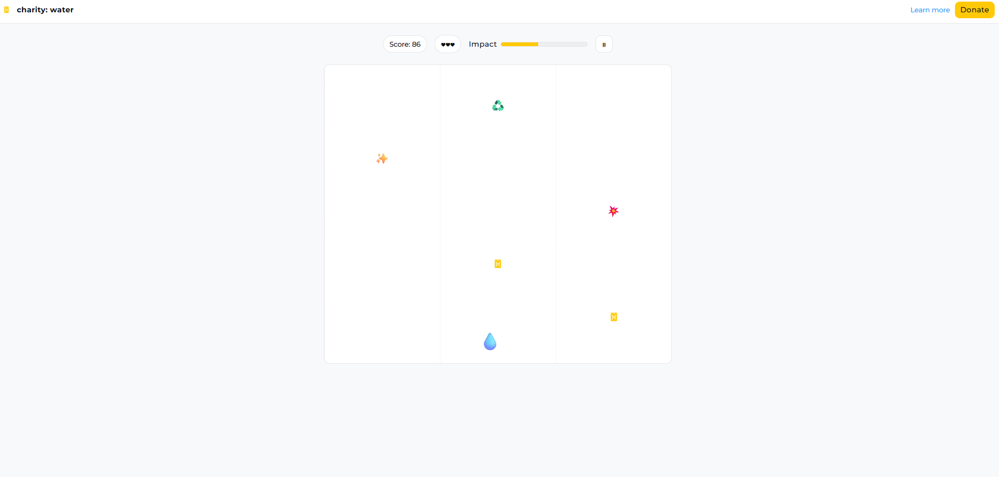

# 💧 Drop Run: Charity: Water Game

A browser-based game that combines interactive gameplay with awareness around access to clean water.  
The project focuses on core game mechanics, real-time state updates, and user engagement using vanilla JavaScript and DOM-based rendering.

---

---

## ✨ Overview

Drop Run is an interactive lane-based game where players control a water droplet and collect positive items while avoiding harmful obstacles.

Players can:
- Control a droplet across multiple lanes using keyboard input
- Collect items that increase score and impact
- Avoid obstacles that reduce lives and score
- Choose different difficulty levels that affect speed and spawn rates
- Complete a run and view impact-related facts at the end

The focus of this project is **game state management**, **real-time updates**, and **interactive UI design** without using external game libraries.

---

## 🚀 Key Features

- **Lane-Based Gameplay**
  - Player movement across three lanes using keyboard controls
  - Collision detection based on lane position and object timing

- **Dynamic Difficulty System**
  - Multiple difficulty modes that adjust game speed, spawn intervals, and time limits
  - Scales challenge while keeping gameplay accessible

- **Scoring, Lives & Impact Tracking**
  - Real-time score and life updates
  - Impact meter that fills based on positive actions
  - Milestone feedback to reinforce player progress

- **Game State Management**
  - Handles transitions between home, gameplay, pause, and results states
  - Includes pause/resume functionality and game-over conditions

- **User Experience Enhancements**
  - Audio feedback for events (collect, hit, win, lose)
  - Confetti-style visual effects on successful completion
  - Responsive layout for different screen sizes

---

## 🛠️ Technical Stack

- **Frontend:** HTML, CSS, JavaScript (ES6)
- **Rendering:** DOM-based elements (no canvas or external game engines)
- **State Management:** In-memory game state with requestAnimationFrame loop
- **Audio:** HTML5 Audio API for sound effects and background music

---

## 🧩 Architecture Notes

- Game logic runs inside a centralized animation loop using `requestAnimationFrame`.
- Objects are dynamically spawned and positioned based on difficulty settings.
- Collision detection is calculated using lane alignment and vertical position thresholds.
- UI state is controlled through view toggling and modal dialogs.

---

## ⚠️ Disclaimer

This project is a **demonstration game built for learning purposes** and inspired by the mission of **charity: water**.  
It is **not an official charity: water product or fundraising tool**.

---

## 👤 Author

**Shivraj Jadeja**  
Software Engineering Apprentice – Global Career Accelerator
